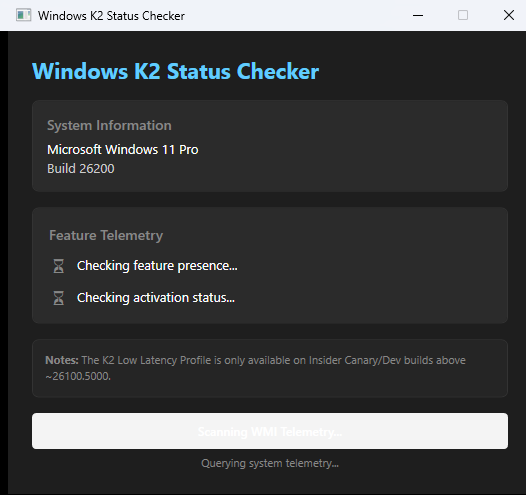
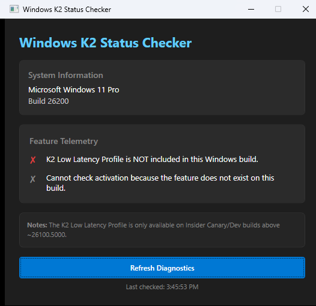

# Check-K2LowLatency

A lightweight, zero-dependency Windows diagnostic utility that inspects WMI telemetry to determine if the **K2 Low Latency Profile** feature is present and active on your system. Available as both a modern WPF GUI desktop app and a standalone PowerShell script.

## Features

- **Zero Third-Party WMI Dependencies:** Direct queries to native `root\cimv2` and `root\wmi` namespaces.
- **Defensive Property Checking:** Inspects WMI schema properties safely without throwing runtime exceptions on non-Insider builds.
- **Dual Interface:** Choose between the native WPF GUI app or the classic PowerShell CLI script.
- **Native Dynamic Theme Support:** Automatically respects Windows Light and Dark Mode system preferences (defaults to Dark Mode).
- **Real-time Diagnostics:** Asynchronously scans WMI namespaces (`root\wmi:MS_SystemInformation`) to detect K2 Low Latency telemetry without locking up the UI.

## Visual UI

| Scanning State | Results State |
| :---: | :---: |
|  |  |

## Usage

### Desktop GUI App (WPF)
1. Build and run `CheckK2LowLatency.slnx` in Visual Studio, or launch the compiled executable from `bin/Release/`.
2. View real-time telemetry or click **Refresh Diagnostics** to re-query system status.

### PowerShell CLI
1. Open PowerShell (v5.1 or v7+).
2. Execute:
```powershell
.\CheckK2LowLatency.ps1